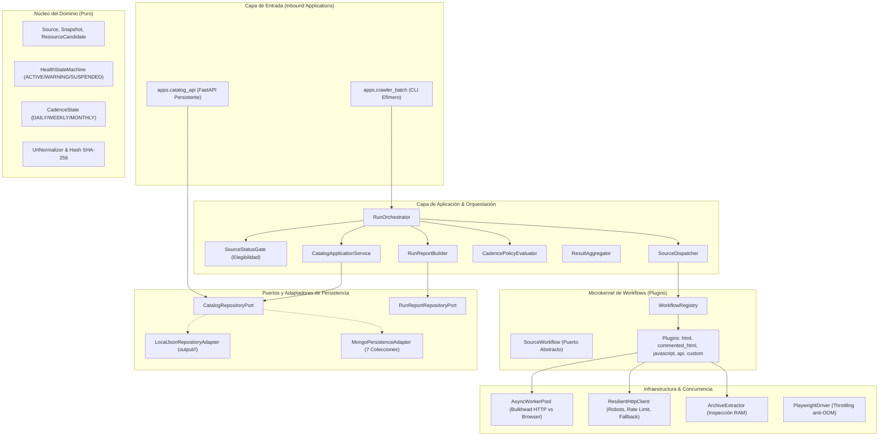
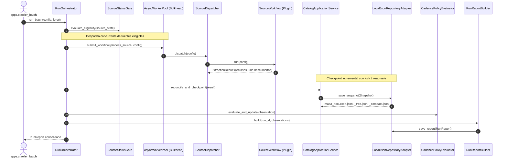

# Prospector Externo de DATAX (`prospector_externo`)

> **Sistema:** Prospector Externo y Catálogo de Inventario Bruto  
> **Estilo Arquitectónico:** Monolito Modular — Arquitectura Hexagonal (Ports & Adapters) + Microkernel de Workflows (Plugin Architecture)  
> **Versión Actual:** 2.0.0  
> **Estado:** Core Hexagonal, Microkernel y Concurrencia Bulkhead implementados y validados.

---

## 1. Visión General

El **Prospector Externo** es el sistema de DATAX diseñado para explorar portales estatales, financieros y regulatorios, descubrir URLs de páginas y recursos públicos descargables (PDF, XLSX, CSV, ZIP), y generar un **inventario bruto trazable** con detección de cambios y control de cadencia.

### Principios Fundamentales del Sistema:
* **Sin almacenamiento de binarios en disco:** El catálogo registra metadatos y cabeceras mediante solicitudes HTTP `HEAD` (con fallback a `GET` streaming mínimo si el servidor responde 405/501).
* **Inspección transitoria de comprimidos en RAM:** Los contenedores `.zip` y `.tar` se descargan transitoriamente en memoria RAM para registrar los archivos internos que contienen y se liberan de inmediato sin tocar el disco.
* **Microkernel de Workflows:** La estrategia de navegación no es un crawler universal monolítico; cada fuente utiliza un plugin especializado (`html`, `commented_html`, `javascript`, `api`, `custom`) configurado de forma declarativa.
* **Concurrencia con Aislamiento Bulkhead (`AsyncWorkerPool`):** Separación estricta entre workers HTTP livianos y workers de navegador pesados (Playwright) para prevenir saturación y proteger la memoria del sistema.

---

## 2. Diagramas Arquitectónicos

### 2.1 Arquitectura Hexagonal y Puertos & Adaptadores



### 2.2 Flujo de Ejecución de una Corrida (Run Pipeline)



---

## 3. Estructura Real del Proyecto

```text
crawler_finrural/
├── apps/
│   ├── crawler_batch/
│   │   └── main.py                     # CLI Batch efímero de exploración
│   └── catalog_api/
│       └── main.py                     # API REST persistente de consulta (FastAPI)
├── config/
│   └── sources.yaml                    # Configuración unificada de fuentes activas
├── src/
│   └── prospector_externo/
│       ├── domain/                     # Modelos y lógica de negocio pura
│       │   ├── models.py               # Source, Snapshot, ResourceCandidate, DiscoveredUrl
│       │   ├── observations.py         # SourceRunObservation, RunReport, CoverageStats
│       │   ├── health.py               # HealthStateMachine (ACTIVE, WARNING, SUSPENDED)
│       │   ├── cadence.py              # CadenceState (DAILY, WEEKLY, MONTHLY)
│       │   └── normalizer.py           # UrlNormalizer (canonicalización estricta y hash)
│       ├── kernel/                     # Contratos y Registro del Microkernel
│       │   ├── workflow_port.py        # SourceWorkflow (Puerto abstracto)
│       │   ├── contracts.py            # ExtractionResult DTO
│       │   └── registry.py             # WorkflowRegistry (Resolución dinámica)
│       ├── workflows/                  # Plugins de descubrimiento
│       │   ├── base.py                 # BaseWorkflow con DiscoveryQueue y resolución paralela
│       │   ├── html_workflow.py        # Plugin HTML estático (ej. FINRURAL)
│       │   ├── commented_html.py       # Plugin HTML comentado (ej. BBV)
│       │   ├── javascript_workflow.py  # Plugin dinámico con Playwright gobernado
│       │   ├── api_workflow.py         # Plugin para portales con endpoints JSON
│       │   └── custom_workflow.py      # Plugin extensible Template Method
│       ├── ports/                      # Puertos salientes de persistencia
│       │   ├── catalog_repository.py   # CatalogRepositoryPort
│       │   └── run_report_repository.py# RunReportRepositoryPort
│       ├── adapters/                   # Implementaciones de adaptadores
│       │   ├── persistence/
│       │   │   ├── local_json_adapter.py # Adaptador local de archivos JSON (output/<source>/)
│       │   │   └── mongo_adapter.py      # Adaptador MongoDB (7 colecciones del documento)
│       │   └── api/
│       │       └── routes.py           # Controladores FastAPI de solo lectura
│       ├── application/                # Servicios de aplicación y orquestación
│       │   ├── status_gate.py          # SourceStatusGate
│       │   ├── dispatcher.py           # SourceDispatcher
│       │   ├── catalog_service.py      # CatalogApplicationService (Checkpointing)
│       │   ├── cadence_evaluator.py    # CadencePolicyEvaluator
│       │   ├── aggregator.py           # ResultAggregator
│       │   ├── report_builder.py       # RunReportBuilder
│       │   └── orchestrator.py         # RunOrchestrator con AsyncWorkerPool
│       └── infrastructure/             # Adaptadores técnicos
│           ├── http_client.py          # ResilientHttpClient (robots.txt, rate limit, fallback)
│           ├── archive_extractor.py    # ArchiveExtractor (descompresión en memoria RAM)
│           ├── browser_driver.py       # PlaywrightDriver (pool acotado anti-OOM)
│           └── concurrency.py          # AsyncWorkerPool (Bulkhead HTTP vs Browser)
├── tests/                              # Suite de 19 pruebas unitarias y de integración
└── output/                             # Salidas particionadas por fuente y reportes
    ├── finrural/                       # mapa_finrural.json, _tree.json, _compact.json
    ├── bbv/                            # mapa_bbv.json, _tree.json, _compact.json
    ├── reports/                        # Reportes históricos run_<id>.json
    └── state/                          # Snapshots y observaciones maestras
```

---

## 4. Fuentes Configuradas Activas (`config/sources.yaml`)

Actualmente el sistema cuenta con dos fuentes completamente parametrizadas y operativas:

1. **`finrural`**: Asociación de Instituciones Financieras de Desarrollo
   * **Workflow:** `html`
   * **Semillas:** Reporte financiero mensual y archivo histórico.
   * **Cadencia:** `MONTHLY`
   * **Filtros:** Exclusión de rutas de contenido institucional (`/historia/`, `/mision-y-vision/`, etc.).
2. **`bbv`**: Bolsa Boliviana de Valores
   * **Workflow:** `commented_html`
   * **Semillas:** Estadísticas, memorias anuales, información financiera y hechos relevantes.
   * **Cadencia:** `DAILY`

---

## 5. Modos de Uso y Ejecución

### 5.1 Ejecutar Proceso Batch de Exploración (Crawler)

Ejecutar todas las fuentes configuradas respetando o forzando cadencia:
```bash
# Ejecutar evaluando elegibilidad de cadencia:
.venv/bin/python3 -m apps.crawler_batch.main --config config/sources.yaml

# Forzar ejecución inmediata de todas las fuentes:
.venv/bin/python3 -m apps.crawler_batch.main --config config/sources.yaml --force

# Ejecutar únicamente una fuente específica:
.venv/bin/python3 -m apps.crawler_batch.main --config config/sources.yaml --source finrural --force
.venv/bin/python3 -m apps.crawler_batch.main --config config/sources.yaml --source bbv --force
```

### 5.2 Ejecutar la API del Catálogo (FastAPI)

Iniciar el servicio de consulta de solo lectura:
```bash
.venv/bin/python3 -m apps.catalog_api.main
```
O mediante Uvicorn:
```bash
.venv/bin/uvicorn apps.catalog_api.main:app --host 0.0.0.0 --port 8000 --reload
```

#### Endpoints Disponibles (Sección 14.2):
* `GET /catalog/sources`: Catálogo de fuentes y su estado de salud operativo (`ACTIVE`, `WARNING`, `SUSPENDED`).
* `GET /catalog/sources/{source_id}`: Detalle operativo y metadatos de una fuente.
* `GET /catalog/resources?source_id={id}`: Consulta de recursos descubiertos con filtros básicos.
* `GET /runs`: Listado histórico de corridas ejecutadas.
* `GET /runs/{run_id}/report`: Reporte de corrida estructurado (`RunReport`) con métricas de cobertura.
* `GET /sources/{source_id}/observations`: Historial de observaciones y cambios (`CHANGED`, `NO_CHANGE`) de una fuente.

---

## 6. Persistencia y Contratos de Salida (Sección 10 y 16)

Siguiendo el modelo de datos de la arquitectura (equivalente a las colecciones `snapshots`, `resource_candidates` y `run_reports` en MongoDB), el adaptador de persistencia local genera en `output/`:

* **Snapshot de Inventario Bruto (`output/<source_id>/mapa_<source_id>.json`):** Catálogo de recursos candidatos descubiertos (`ResourceCandidate`), metadatos de cabeceras HTTP, vigencia temporal inferida y hash de integridad SHA-256.
* **Reporte de Corrida (`output/reports/run_<id>.json`):** Registro formal de auditoría (`RunReport`) con las métricas de cobertura (`CoverageStats`), fuentes procesadas, omitidas o fallidas y resultado de novedades (`CHANGED` / `NO_CHANGE`).
* *Vistas complementarias locales:* Para compatibilidad con visores de prototipos previos, el adaptador local también exporta proyecciones en árbol (`_tree.json`) y compacta (`_compact.json`).

---

## 7. Rendimiento y Concurrencia (Benchmark)

Gracias a la integración del **`AsyncWorkerPool`** con aislamiento Bulkhead y paralelización de solicitudes `HEAD`, el rendimiento se optimizó drásticamente:

| Métrica | Modo Secuencial Anterior | Con `AsyncWorkerPool` | Factor de Mejora |
| :--- | :---: | :---: | :---: |
| **Tiempo Corrida Batch (2 Fuentes)** | **7 min 49 s** | **1 min 36 s** | **~5x más rápido** ⚡ |
| **FINRURAL (130 recursos en 30 páginas)** | ~2 min 39 s | **~37 s** | ~4.3x |
| **BBV (235 recursos en 30 páginas)** | ~5 min 10 s | **~58 s** | ~5.3x |
| **Concurrencia entre Fuentes** | Serial (1 por 1) | **Paralela al unísono** | Multidominio |
| **Consulta de Cabeceras HTTP** | Serial (1s delay forzado) | **Pool concurrente (8 workers)** | Keep-alive |

---

## 8. Suite de Pruebas Automatizadas

El proyecto cuenta con **19 pruebas unitarias y de integración** que cubren el 100% de las capas arquitectónicas:

```bash
.venv/bin/pytest tests/ -v
```

```text
tests/test_archive_extractor.py::test_is_archive PASSED                  [  5%]
tests/test_archive_extractor.py::test_inspect_zip_archive_bytes PASSED   [ 10%]
tests/test_archive_extractor.py::test_inspect_tar_archive_bytes PASSED   [ 15%]
tests/test_async_worker_pool.py::test_async_worker_pool_bulkhead_isolation PASSED [ 21%]
tests/test_async_worker_pool.py::test_async_worker_pool_run_parallel PASSED [ 26%]
tests/test_catalog_api.py::test_catalog_api_routes PASSED                [ 31%]
tests/test_domain_health_and_cadence.py::test_health_state_machine_success_and_failure PASSED [ 36%]
tests/test_domain_health_and_cadence.py::test_cadence_conservative_adaptation PASSED [ 42%]
tests/test_domain_models.py::test_resource_candidate_model PASSED        [ 47%]
tests/test_domain_models.py::test_snapshot_immutability_and_dump PASSED  [ 52%]
tests/test_domain_models.py::test_source_model_validation PASSED         [ 57%]
tests/test_domain_models.py::test_source_config_defaults PASSED          [ 63%]
tests/test_local_json_adapter.py::test_local_json_adapter_snapshot_export PASSED [ 68%]
tests/test_local_json_adapter.py::test_local_json_adapter_run_report PASSED [ 73%]
tests/test_orchestrator_hexagonal.py::test_orchestrator_incremental_runs_and_change_detection PASSED [ 78%]
tests/test_sources_config.py::test_sources_yaml_structure PASSED         [ 84%]
tests/test_url_normalizer.py::test_url_normalization PASSED              [ 89%]
tests/test_url_normalizer.py::test_url_hash_deterministic PASSED         [ 94%]
tests/test_workflow_registry.py::test_registry_resolution PASSED         [100%]

======================== 19 passed in 0.40s ========================
```
